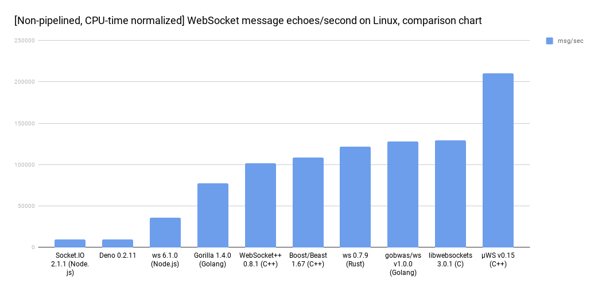

# Benchmark-driven development

Just like testing code for correctness and stability, testing for performance is just as important if performance is a goal. You cannot really argue or reason about performance without having tests for it.

* Do not trust anyone who claims performance of any kind unless they provide benchmarks. Do not listen to people who talk about performance without having actual scientific data to back their claims up.
* Never accept absolute numbers without a direct comparison with an alternative solution. Many projects can give you a number, X, which can be "50 billion messages per second". How much is this? What kind of worth does this number have? Impossible to know without a comparison. Absolute numbers mean nothing, relative comparisons are what you should look for.
* Make sure to benchmark the correct thing. This is an extremely common mistake, done by many of the most well-known developers out there. If you measure for CPU-time efficiency (which you do) then normalizing for spent CPU-time is the difference between a completely invalid, botched and bogus test and something that might be valid.

Here are the current relative comparisons:

Http | WebSockets
--- | ---
 | 
